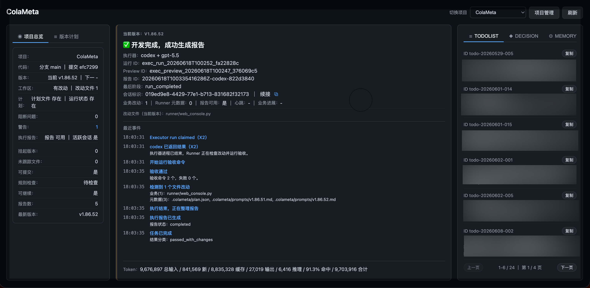

```
   ______      __                      __     
  / ____/___  / /___ _____ ___  ____ _/ /____ 
 / /   / __ \/ / __ `/ __ `__ \/ __ `/ __/ _ \
/ /___/ /_/ / / /_/ / / / / / / /_/ / /_/  __/
\____/\____/_/\__,_/_/ /_/ /_/\__,_/\__/\___/ 

🥤 enjoy your vibe coding with GPTs! ✨
```

# ColaMeta

[**English**](README.md) | [**中文**](README.zh-CN.md)

# ColaMeta 是什么？

ColaMeta 是一个致力于把 vibe coding 推广给更多非专业人群的项目。

它通过构建 ChatGPT / GPTs 到本地执行器（Codex、OpenCode 等）的编排层，让你可以把更多精力放在创意、需求和决策上，而不是具体代码实现。

简而言之：

**你是需求的甲方。**
你提出需求、补充约束、做关键业务决策。

**ColaMeta 是运行在你设备上的 AI 乙方团队。**
它把 GPTs、本地执行器、版本计划、提示词、审计包、验证、项目记忆、Git 闭环和 Web 观察窗口组合在一起。

**GPTs 是这个团队的负责人。**
它像产品经理、架构师和审查负责人一样，负责理解你的需求、确认做什么和不做什么、拆分版本、生成严格执行提示词、安排开发、审查结果，并决定是否继续修复、提交、推送或推进下一个版本。

**本地执行器是代码实现工程师。**
Codex、OpenCode 等执行器根据 GPTs 的指令要求，读代码、改代码、跑测试，并输出执行报告。

**Web Console 是你观察这个 AI 团队工作的窗口。**
你可以看到版本进度、提示词、执行器状态、执行报告、审计包、项目记忆、决策记录和下一步动作。

ColaMeta 的目标不是让你学会管理 AI 写代码的每个细节，而是让你像委托一个外包团队一样，把需求交给 GPTs + 本地执行器组成的 AI 团队完成。

---

## 一个需求如何被 ColaMeta 交付？

```text
人类：
“我要实现 XXX 功能。”

  ↓

GPTs：
“明白了。这个功能需要拆成 2 个版本：
v1 先完成基础能力，v2 再补交互和边界处理。”

  ↓

ColaMeta：
新增 2 个待开发版本，
保存每个版本的目标、执行提示词、允许修改文件、禁止修改文件和验收命令。

  ↓

GPTs：
“当前版本涉及文件比较多，需要更强的模型。
我会选择合适的本地执行器和模型来实现。”

  ↓

本地执行器：
根据 GPTs 的严格提示词读代码、改代码、跑测试，并输出执行报告。

  ↓

ColaMeta：
记录版本开发结果、执行报告、审计包、验证状态和 changed files。

  ↓

GPTs：
“我不能只相信执行器自己说完成了。
我要审查 diff、报告、验证结果和审计包。”

  ↓

GPTs：
“这里有一点不对，我来安排修正。
修正后验证通过，可以提交和推送。”

  ↓

ColaMeta：
完成受控 Git 提交和推送，
记录当前 HEAD。

  ↓

GPTs：
“继续开发下一个版本。”

  ↓

GPTs：
“两个版本都完成了。
你要的 XXX 功能已经实现。
本次修改了 A、B、C 文件。
当前提交 HEAD 是 abc1234。”
```

这就是 ColaMeta 的核心工作流：
**人类提出需求，GPTs 负责交付，本地执行器负责实现，ColaMeta 负责流程、证据和闭环。**

---

## 为什么不是直接让大模型写代码？

普通 vibe coding 通常是：

```text
人类用自然语言告诉模型要做什么
模型直接改代码
人类自己看 diff、跑测试、判断能不能提交
```

ColaMeta 的方式是：

```text
人类提出需求
  ↓
GPTs 理解需求和边界
  ↓
GPTs 生成严格执行提示词
  ↓
提示词明确 allowed files / forbidden files / acceptance commands
  ↓
本地执行器按提示词开发
  ↓
GPTs 读取报告、diff、验证结果和审计包
  ↓
GPTs 判断是否闭环、是否继续修、是否提交推送
  ↓
人类只看最终结果和需要自己决策的问题
```

你不是把代码交给一个黑箱模型。
你是在把需求委托给一个由 GPTs 负责、由本地执行器实现、由 ColaMeta 监管流程的 AI 乙方团队。

---

## 核心角色

### 人类：甲方

你负责：

- 描述想要什么
- 说明不想要什么
- 补充业务约束
- 做关键产品决策
- 接受或否定最终结果

你不需要默认承担：

- diff reviewer
- 测试工程师
- Git 操作员
- 架构审查员
- 执行器调度员

这些复杂 coding 流程由 GPTs + ColaMeta + 本地执行器承担。

### GPTs：团队负责人

GPTs 负责：

- 理解需求
- 拆分版本
- 生成执行提示词
- 决定哪些文件可以改、哪些文件不能动
- 选择或接收本地执行器和执行模型
- 驱动执行器开发
- 审查执行器报告
- 检查 diff、验证结果和审计包
- 判断是否继续修复、提交、推送或进入下一个版本

ColaMeta 更推荐和 GPTs 配合使用，因为 GPTs 支持自定义指令，可以稳定承担团队负责人、项目经理和审查负责人角色。

### 本地执行器：代码实现工程师

Codex、OpenCode 等执行器负责：

- 读代码
- 改代码
- 跑测试
- 输出报告

执行器不直接决定项目方向。
它们按照 GPTs 生成的受控任务执行。

### ColaMeta：工作流和交付系统

ColaMeta 负责：

- 项目登记
- 项目路由
- source-only / managed 模式
- 版本计划
- prompt 保存和插入
- preview / apply
- 执行器调度
- 报告和审计包
- 项目记忆
- Git 提交和推送
- Web 观察窗口

---

## Web Console：甲方观察乙方工作的窗口

ColaMeta Web Console 不是普通开发者控制台。

它是甲方观察 AI 乙方团队内部工作状态的窗口。



你可以通过 Web Console 看到：

- 执行器有没有启动
- 当前是否正在运行
- 执行器跑到什么阶段
- 当前项目处于哪个版本
- 版本开发进度如何
- GPTs 生成的提示词是什么
- 执行器报告写了什么
- 审计包和验证状态如何
- 当前 Git 状态如何
- GPTs 记住了哪些项目记忆
- 哪些用户决策已经被记录
- GPTs 是否正确理解了你的决策
- 接下来还有哪些动作可以做

你不需要亲自当工程负责人。
但你可以随时监察、观察和纠偏。

---

## 版本计划：从开始要求到最终报告的交付闭环

在 Web Console 的版本计划里，每个版本都可以关联查看执行提示词和执行报告。

这意味着 ColaMeta 不只是显示“任务完成了”，而是保留了完整的交付链路：

```text
这个版本开始时 GPTs 给执行器的要求是什么
哪些文件可以改
哪些文件不能动
验收标准是什么
执行器最终做了什么
验证和审计结果如何
这个版本为什么被判定为完成或未完成
```

人类可以像甲方查看外包交付记录一样，回看每个版本从需求到结果的全过程。

---

## 你可以同时把多个项目委托给 ColaMeta

ColaMeta 不是只能服务一个当前目录。

你可以把多个本地项目登记给 ColaMeta：

```bash
colameta add my-app /path/to/my-app managed
colameta add my-site /path/to/my-site managed
colameta add open-source-lib /path/to/open-source-lib source-only
```

然后在 ChatGPT / GPTs 对话里告诉它：

```text
这次你负责 my-app 项目。
我要你修复登录页的跳转问题。
```

之后 GPTs / ColaMeta 的所有项目级操作都会显式路由到 `my-app`。

它不会靠当前工作目录猜项目。
不会因为你刚才打开过另一个项目就串线。
不会把 A 项目的 prompt、记忆、报告或 Git 操作误用到 B 项目。

---

## 多个 GPTs 对话并行开发多个项目

在多项目能力支持下，你可以同时打开多个 GPTs 对话，让它们分别负责不同项目。

例如：

- 一个对话负责 `my-app`
- 一个对话负责 `my-site`
- 一个对话负责 `open-source-lib`

每个对话只需要明确自己当前负责的 `project_name`。
之后这个对话里的 GPTs / ColaMeta 操作都会路由到对应项目。

这意味着你可以同时推进多个项目的开发，而不用担心它们互相串线。

你可以像管理多个外包团队一样管理多个 AI 项目团队：

```text
每个项目有自己的负责人对话
每个项目有自己的执行器任务
每个项目有自己的版本计划
每个项目有自己的项目记忆
每个项目有自己的执行报告和审计包
每个项目有自己的 Git 闭环
```

这样可以显著提高多个项目并行开发的速度，同时保持项目之间清晰隔离。

---

## 每个项目都有自己的记忆

普通 ChatGPT 对话有一个问题：
新开对话后，它可能忘记项目背景、历史决策、之前提过但还没做的点子。

ColaMeta 在 managed 模式下会把项目记忆保存在项目自己的 `.colameta/` 目录中。

常见记忆包括：

- `memory`：项目总记忆，比如长期事实、架构边界、项目约定
- `decision`：你已经确认过的决策，比如产品取舍、架构方向、长期规则
- `todolist`：你告诉它但还没实施的点子、bug、后续事项

所以你可以新开一个 GPTs 对话，然后说：

```text
继续负责 my-app 项目。
先读取项目记忆和待办，告诉我现在应该做什么。
```

GPTs 可以通过 ColaMeta 找回这个项目的 memory、decision 和 todolist，继续之前的工作。

这意味着 ColaMeta 不只是连接本地代码。
它还让每个项目拥有自己的长期上下文。

---

## 两种项目模式

### source-only

source-only 是轻量接入模式。

它适合你已经有一个源码项目，希望 ChatGPT / GPTs 能连接到本地执行器，让它帮你读代码、分析问题、生成提示词、驱动执行器完成局部任务。

source-only 更像：

```text
ChatGPT / GPTs
  ↓
ColaMeta
  ↓
本地项目 + 本地执行器
```

它适合已有项目的轻量协作，不强制接管完整版本管理。

### managed

managed 是完整托管模式。

它在 source-only 基础上增加：

- Runner 版本计划
- 当前版本状态
- allowed files / forbidden files
- acceptance commands
- prompt 文件管理
- 执行器报告
- 审计包
- 项目记忆
- workflow 记录
- Git 提交
- Git 推送
- 版本推进

managed 更像：

```text
人类甲方
  ↓
GPTs 团队负责人
  ↓
ColaMeta 托管工作流
  ↓
本地执行器工程师
  ↓
报告 / 审计 / 验证 / Git 闭环
```

managed 模式把 ChatGPT / GPTs 变成一个本地开发交付团队的负责人。

---

## 上下文不乱，成本可见

本地执行器也有自己的对话上下文。

如果每个任务都新开，会浪费大量 token，也无法利用已有上下文和缓存。
如果所有任务都强行续接，又可能把不相关任务混在一起，导致执行器误判、污染上下文。

ColaMeta 会把执行器会话新开 / 续接变成一个受控决策。

GPTs 可以根据当前项目、分支、执行器 provider、session identity、任务语义、风险和缓存命中目标，判断本次任务应该：

- 续接已有执行器会话，提高缓存命中和上下文连续性
- 新开执行器会话，避免上下文污染和误接错误任务

每次执行器任务都会独立记录 token usage，包括输入、输出、缓存命中、缓存写入和 cache hit rate。

这让人类甲方可以在 Web Console 或执行报告里看到：

- 这个任务实际花了多少 token
- 缓存命中了多少
- 是否因为合理续接降低了成本
- 某个任务为什么需要新开会话

---

## GPTs 配置参考

ColaMeta 更推荐和 GPTs 配合使用。

你可以把 GPTs 配置成 AI 乙方团队的负责人，让它负责理解需求、生成执行提示词、调度本地执行器、审查结果、推进版本和完成 Git 闭环。

参考文档：

- [GPTs 自定义指令参考](assets/gpts/custom-instructions.zh-CN.md)
- [执行提示词写作参考](assets/gpts/prompt-writing.zh-CN.md)
- [AGENTS.md 生成规则](assets/gpts/agents-generation-rules.zh-CN.md)
- [项目记忆规则](assets/gpts/project-memory-rules.zh-CN.md)

---

## 安装

```bash
pip3 install colameta
```

如果系统没有 `pip3`，可以使用 venv：

```bash
python3 -m venv path/to/venv
source path/to/venv/bin/activate
pip3 install colameta
```

安装后可以直接使用 `colameta` 命令。

---

## 快速开始

安装后可以直接使用 `colameta` 命令。

### 登记一个 managed 项目

managed 模式会为项目创建最小 `.colameta/` 结构，并启用完整的版本计划、项目记忆、执行器报告、审计包和 Git 闭环。

```bash
colameta add /path/to/project managed
```

### 登记一个 source-only 项目

source-only 模式适合只想让 GPTs / MCP 连接本地源码和执行器，但暂时不启用完整 Runner 版本管理的项目。

```bash
colameta add /path/to/project source-only
```

### 启动 ColaMeta

```bash
colameta start
```

启动后会同时启动 Web Console 和 MCP HTTP Server。

默认地址：

- Web Console: http://0.0.0.0:8799
- MCP HTTP: http://0.0.0.0:8765/mcp

重启或停止服务：

```bash
colameta restart
colameta stop
```

### 查看已登记项目：

```bash
colameta list
```

### 移除项目登记：

```bash
colameta remove my-project
```

## 环境要求

- Python 3.10+
- Git
- 本地可用的执行器环境，例如 Codex 或 OpenCode

---

## 许可证

本项目开放源代码，但**禁止商业使用**。
